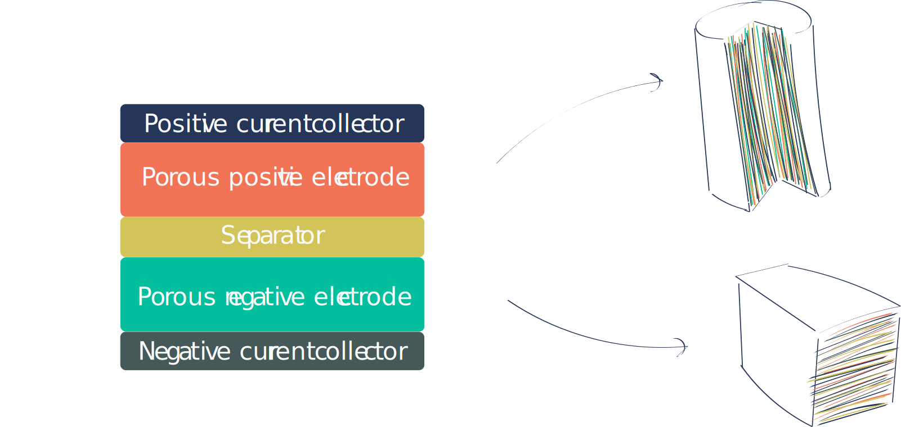
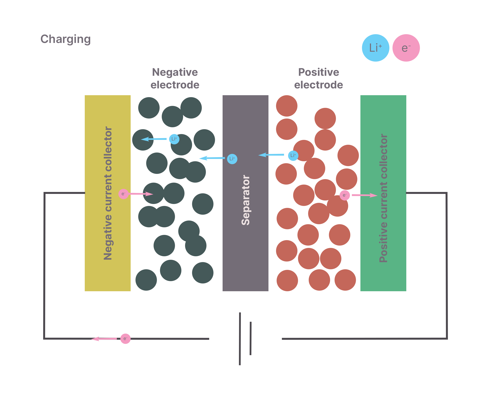
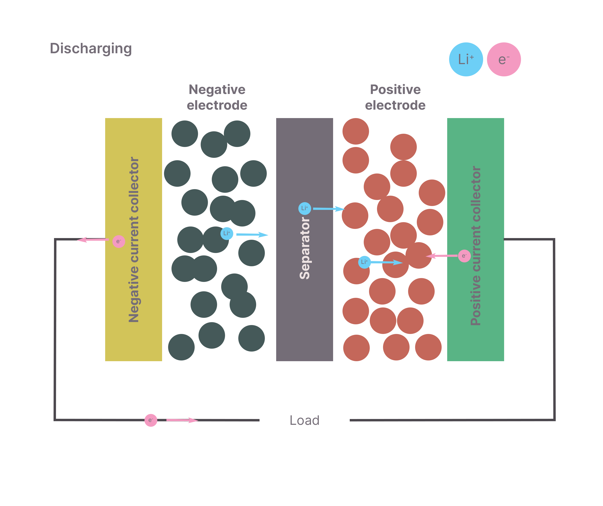
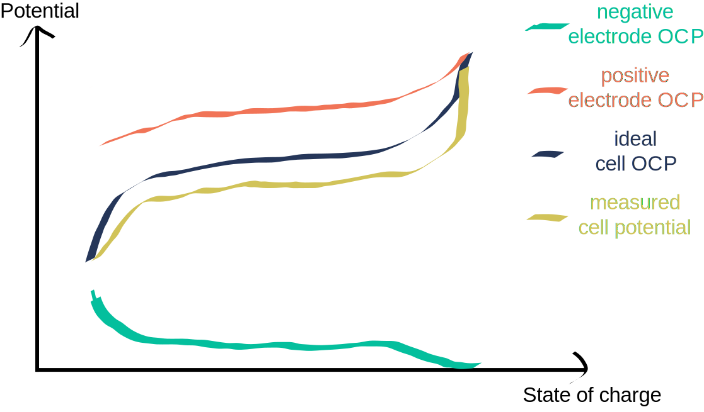

# Fundamentals

## How does a Li-ion battery work?

Cycling a Li-ion battery involves transporting Li-ions from one electrode to another, releasing and storing electrical energy in the process. This also involves the transport of electrons between each electrode through an external circuit. A galvanic cell is a device that converts chemical energy into electrical energy, and an electrolytic cell is a device that converts electrical energy into chemical energy. A Li-ion battery is a rechargeable device that can run as a galvanic or electrolytic cell - we will refer to these as charge (electrolytic) and discharge (galvanic). The electrochemical potential between the two electrodes is increased during charging, storing electrical energy, and decreased during discharging, releasing electrical energy.

### What is it made of?

A Li-ion battery consists of six main components: a positive current collector, a porous positive electrode, a separator, an electrolyte, a porous negative electrode, and a negative current collector. These are stacked together to form a battery cell. These can then be rolled into a cylindrical cell, or stacked into a prismatic cell.

<!-- Image of jelly roll, cylindrical and prismatic, with labels for each component -->
<figure markdown>
  { width="800"}
  <figcaption>The left shows a schematic of one cell. This cells are stacked together into the "jellyroll", which can be wound up into a cylindrical cell (top right) or stacked into a prismatic cell (bottom right).</figcaption>
</figure>

The **positive electrode** is normally a three phase material made of an active material, carbon binder domain and pore. The active material is the material that undergoes a lithium intercalation reaction during the battery discharge and charge cycles. Commomn materials for the positive electrode include NMC, NCA and LFP. The binder is a material that holds the active material together and contributes to electronic conductivity, often a carbon black-polymer substance.

The **negative electrode** is normally a carbon material that undergoes a lithium intercalation reaction.

The **electrolyte** is a component that allows the lithium ions to move between the electrodes. The electrolyte is normally a lithium salt dissolved in an organic solvent.

The **current collectors** are used to conduct the current from the electrodes to the external circuit. The positive current collector is often aluminium foil, and the negative current collector is often copper foil.

The **separator** is a material that prevents the electrodes from shorting by providing ion flow whilst preventing electron flow. These are usually made of insulating porous polymers.

> **Why negative and positive electrode and not anode and cathode?**

> The cathode is the electrode where reduction happens (where a species gains electrons), and the anode is where oxidation happens (gives up electrons). Therefore, which electrode is the cathode and anode depends on whether the cell is being charged or discharged. The positive electrode (often referred to as cathode) always has a positive potential relative to the negative electrode (often referred to as the anode), regardless of the direction of flow of electrons. During discharge, the positive electrode is the cathode and the negative electrode is the anode - this is where the conventional names come from. We will use the terms positive and negative electrode throughout this wiki.

### Charging and discharging

<figure markdown>
  { width="500"}
  { width="500"}
  <figcaption>A schematic of charging and discharging in a Li-ion cell.</figcaption>
</figure>

During charging, an external potential is applied to the cell, driving lithium ions from the positive electrode into the negative electrode and increasing the cell potential. During discharging, the cell is connected to a load, and the cell potential is reduced as lithium ions travel from the negative electrode to the positive electrode.

The open circuit potential (OCP) is the potential difference between the two electrodes when the battery is not connected to a load. Each electrode can be measured against a standard lithium metal electrode and the difference is then taken to give the OCP of the battery. The OCP is a function of the lithiation state of the electrodes, as the ability of the electrodes to oxidise/reduce changes with lithiation. The OCP is the "driving force" of the battery, which will be further explained in the [interface](../interface/interface.md) section. The ideal discharge of a battery is the difference between the OCP curves of each electrode (see ).

<!-- OCP curves as one minus the other -->
<figure markdown>
  { width="500"}
  <figcaption>The OCP curves of the positive and negative electrodes, the total cell OCP and an example of a measured potential.</figcaption>
</figure>

The measured potential of the cell can differ from the difference between the OCPs of the electrodes due to overpotentials. Overpotentials are the result of the cell not being at equilibrium, and can be split into two main categories:

- **Internal resistance** - the resistance of the cell to the flow of electrons.
- **Charge transfer resistance** - the resistance of the cell to the flow of lithium ions.

Overpotentials are the cause of non-ideal behaviour in the battery, and result in an apparent reduction in capacity. Understanding the causes of these overpotentials is important for the design of batteries.

Now we know about the basic components and operation of a Li-ion battery, we can look at the charge transport mechanisms in the [electrode](../electrode/electrode.md), [electrolyte](../electrolyte/electrolyte.md) and [interface](../interface/interface.md).
